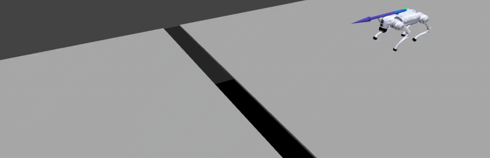

<div align="center">

# Robot Safety Sandbox

**Massively-parallel [mjlab](https://github.com/mujocolab/mjlab) environments for safety-policy
synthesis, task-policy training, and safety-filter evaluation** — reach-avoid and avoid, single-player
and zero-sum two-player, on the GPU end-to-end.

[](https://saferoboticslab.github.io/robot-safety-sandbox/)
[](https://github.com/SafeRoboticsLab/robot-safety-sandbox/releases)
[](https://www.python.org/)
[](LICENSE)

### [📖 Read the documentation →](https://saferoboticslab.github.io/robot-safety-sandbox/)

[Requirements](https://saferoboticslab.github.io/robot-safety-sandbox/getting-started/requirements/) ·
[Installation](https://saferoboticslab.github.io/robot-safety-sandbox/installation/) ·
[Quickstart](https://saferoboticslab.github.io/robot-safety-sandbox/getting-started/quickstart/) ·
[Environments](https://saferoboticslab.github.io/robot-safety-sandbox/environments/) ·
[Build a task (tutorial)](https://saferoboticslab.github.io/robot-safety-sandbox/tutorial-car-goal/)



*A Go2 quadruped crossing a terrain gap under a learned safety filter — one of the parkour tasks
shipped in the sandbox.*

</div>

> ### 📣 August 2026 — v0.4.0 is released!
> The **MAP alignment** (the registry derives each learner's name by formula — Mode·Algorithm·Players),
> a **composable safety-filter library** (a filter is a composition of fallback · monitor ·
> intervention modules, not a class per recipe), a **unified evaluation harness**, config-driven
> **train-inside-a-safety-filter** (PORL), a from-scratch **`car_goal` tutorial + validated recipe**,
> and a rebuilt documentation site. Requires [`safety_sb3` v0.4.0](https://github.com/SafeRoboticsLab/safety-stable-baselines).

## What is this?

Robot Safety Sandbox is a library of GPU-resident **mjlab** benchmark environments for
[`safety_sb3`](https://github.com/SafeRoboticsLab/safety-stable-baselines) (safety-stable-baselines).
Each task exposes a clean margin contract — a safety margin `g(s)` on the reward channel and an
optional target margin `l(s)` — so the same env drives avoid or reach-avoid learning, single-player or
adversarial, at thousands of parallel environments. On top of the tasks it ships a **composable
safety-filter** library and a **unified eval harness** for putting a filtered policy through its paces.

| | |
|---|---|
| 🧩 **Synthesize a safety policy** | Reach-avoid / avoid learning on parallel mjlab envs, single-player or zero-sum two-player, via `safety_sb3`. |
| 🎮 **Train a task policy** | Ordinary dense-reward RL (stock SB3) for the nominal policy a filter wraps. |
| 🛡️ **Compose a safety filter** | A filter = fallback · monitor · intervention — swap modules, don't write a class per recipe. |
| 📊 **Evaluate** | One harness reports reach / safe / violation rates for a policy, filtered or bare, under attack. |

> The package is `robot_safety_sandbox` (renamed from `safe_mjlab_zoo`).

## Documentation

📖 **https://saferoboticslab.github.io/robot-safety-sandbox/** is the canonical reference —
requirements, installation, a five-minute quickstart, the environment catalog, a from-scratch task
tutorial, the MAP naming convention, the `(g, l)` margin contract, the safety-filter architecture, and
the full API + CLI reference. **Start there.**

## Requirements

**Linux + an NVIDIA GPU**, Python ≥ 3.10, and the pinned mjlab / MuJoCo-Warp sim stack. Robot assets
(Go2, Digit), terrains, and the handover dataset ship natively in-tree. `safety_sb3` is a pinned pip
dependency. See [requirements](https://saferoboticslab.github.io/robot-safety-sandbox/getting-started/requirements/).

## Install

```bash
git clone git@github.com:SafeRoboticsLab/robot-safety-sandbox.git
cd robot-safety-sandbox
pip install -e .        # pulls safety_sb3 @ v0.4.0 (pinned) + the mjlab sim stack
```

Full steps (sim-stack pins, GPU notes) are in the
[installation guide](https://saferoboticslab.github.io/robot-safety-sandbox/installation/).

## Quickstart

Verify the registry imports (CPU only — no GPU or simulator needed):

```bash
python -c "from robot_safety_sandbox import list_tasks; print(list_tasks())"   # ~45 task IDs
```

Smoke-train the tutorial task — `car_goal`, a small differential-drive reach-avoid task — for a few
seconds and write a checkpoint:

```bash
python examples/train.py --config configs/car_goal.yaml \
    --num-envs 256 --steps 200000 --no-wandb          # -> runs/car_goal/final_model.zip
```

Evaluate it (reach / safe / violation rates):

```bash
python examples/eval.py --task car_goal \
    --safety-policy runs/car_goal/final_model.zip --safety-only \
    --no-filter --num-envs 512 --steps 700
```

Drop the `--num-envs` / `--steps` overrides to run the **full recipe** — 25M env-steps, ≈60–67% of
goals reached at near-zero violations. The complete walkthrough (and a from-scratch build of the task)
is in the [quickstart](https://saferoboticslab.github.io/robot-safety-sandbox/getting-started/quickstart/)
and [car-goal tutorial](https://saferoboticslab.github.io/robot-safety-sandbox/tutorial-car-goal/).

## The MAP — one naming law across both repos

A learner's class name is three axes and nothing else, and the registry *derives* it by formula — no
lookup table, no per-task override:

```
M = Mode       Safety | ReachAvoid | Cumulative    (the Bellman operator — a property of the TASK)
A = Algorithm  PPO | SAC | A2C | DQN               (the RL update — chosen at the RUN: --family)
P = Players    1P | 2P                             (single | zero-sum — chosen at the RUN: --adversary)
```

```python
>>> from robot_safety_sandbox import algo_name
>>> algo_name("car_goal")                                          # M=ReachAvoid A=PPO P=1P
'ReachAvoidPPO1P'
>>> algo_name("go2_stabilize", adversary=True, family="off_policy")
'ReachAvoidSAC2P'
```

The **Mode** comes from the task's `TaskSpec` (a property of its margins); **Algorithm** and
**Players** come from the run. Full law + the `(g, l)` contract:
[MAP convention](https://saferoboticslab.github.io/robot-safety-sandbox/concepts/map/) ·
[margins](https://saferoboticslab.github.io/robot-safety-sandbox/concepts/margins/).

## Environments

Go2 (stabilize / locomotion / gap-jumping / crawl), Digit (humanoid stabilize), and the `car_goal`
tutorial task — avoid and reach-avoid, single- and two-player. Browse the
[environment catalog](https://saferoboticslab.github.io/robot-safety-sandbox/environments/); porting
a new task is four steps in the [porting guide](https://saferoboticslab.github.io/robot-safety-sandbox/porting/).

## Citation

If this sandbox supports your research, please cite the software:

```bibtex
@misc{nguyen2026sandbox,
  author       = {Nguyen, Duy P. and Fisac, Jaime F.},
  title        = {{Robot Safety Sandbox: Massively Parallel Environments for Safety-Policy Synthesis and Evaluation}},
  year         = {2026},
  howpublished = {\url{https://github.com/SafeRoboticsLab/robot-safety-sandbox}},
  note         = {Version 0.4.0, computer software}
}
```

and the underlying safety-RL methods (Fisac et al. ICRA'19; Hsu et al. RSS'21; Hsu, Nguyen et al.
L4DC'23) — see [`safety_sb3`](https://github.com/SafeRoboticsLab/safety-stable-baselines#citation) for
the full list.

## License

[MIT](LICENSE) © Safe Robotics Lab, Princeton University.
