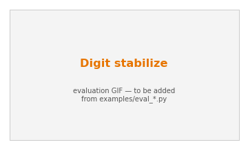

# Digit stabilize

An Agility **Digit** humanoid must stay upright against a **worst-case torso
force** — a two-player *avoid* game (ISAACS proper): the control policy maximizes
the safety value, an adversary applies the most destabilizing admissible force,
and the learned value is the robust-invariance certificate.

{ width="420" }

## Tasks

| task | objective | learner (1P → 2P) |
|---|---|---|
| `digit_stabilize` | stand / track vs adversarial torso force (**reach-avoid**, real target) | `ReachAvoidPPO` → `GameplayPPO` |
| `digit_stabilize_avoid` | stay upright forever (**avoid**) | `SafetyPPO` → `IsaacsPPO` |
| `digit_stabilize_stay` / `digit_box_stabilize_*` | stance-set viability variants | `SafetyPPO` → `IsaacsPPO` |

The avoid tasks are genuine two-player **avoid** games — with `--adversary` they
resolve to `IsaacsPPO` (ISAACS eq. 7, no target set). They do **not** emulate
avoid with a degenerate `l` (the retired `l_neg` pattern): avoid is not a
reach-avoid instance — see the [API guide](../API.md#5-marginspy).

## Margins

- **`g`** (safety) = upright / stance integrity: torso tilt, base height,
  non-foot contact — negative on a fall. Digit *stepping* needs the
  `MjlabSafety_Digit` `entity.py` fork patch.
- **`l`** (target, `digit_stabilize` only) = in the target stance set (upright,
  at rest). The avoid variants declare no `l`.

## Run it

```bash
python examples/train.py --task digit_stabilize_avoid --adversary   # -> IsaacsPPO (two-player avoid)
python examples/train.py --task digit_stabilize                      # reach-avoid, single-player
```

```python
from robot_safety_sandbox import make_tensor, algo_name
env = make_tensor("digit_stabilize_avoid", num_envs=2048, adversary=True)
# algo_name("digit_stabilize_avoid", adversary=True) -> "IsaacsPPO"
```
