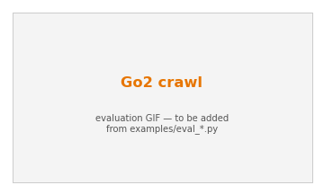

# Go2 crawl

A Unitree Go2 must **duck under a low bar or stop** — the campaign's second
benchmark for *temporal commitment*: a closing gate creates a region where
standing still eventually becomes unsafe, so the robot must decide to crawl
through in time. Unlike the gap, there is no gait-phase launch conversion, which
sidesteps the co-adaptation wall.

{ width="520" }

## Tasks

| task | objective | learner |
|---|---|---|
| `go2_crawl` | duck under the bar → safe rest past it | `ReachAvoidPPO` |
| `go2_crawl_duck` | momentum approach at a low bar + forward-velocity reach | `ReachAvoidPPO` |
| `go2_crawl_gate_ra` / `_gate_avoid` | **closing-gate twins**: descending virtual ceiling (RA vs avoid) | `ReachAvoidPPO` / `SafetyPPO` |
| `go2_crawl_twin_ra` / `_twin_avoid` | static-bar twins (negative control: no committed region ⟹ avoid == RA) | `ReachAvoidPPO` / `SafetyPPO` |
| `go2_crawl_isaacs` | crawl + worst-case base-force adversary | `GameplayPPO` |

The `*_twin_*` and `*_gate_*` pairs are the claim's controlled experiment: the
avoid and reach-avoid twins share one `g`, and differ only in whether an `l`
target is present — the contrast should appear **only** where a committed region
exists (the closing gate), not on the static bar.

## Margins

- **`g`** (safety) = crawl integrity: terrain-relative height / tilt / non-foot
  contact, plus (gate variant) a virtual descending-ceiling term and a
  `crushed_by_gate` termination.
- **`l`** (target) = forward-velocity liveness / rest past the bar (`≥ 0` once
  through). The avoid twin declares no `l` (`compose(g_fn)`); see
  [margins](../reference.md#margins).

## Run it

```bash
python examples/train.py --task go2_crawl_gate_ra        # reach-avoid, closing gate
python examples/train.py --task go2_crawl_gate_avoid     # avoid control
```

```python
from robot_safety_sandbox import make_tensor
env = make_tensor("go2_crawl_gate_ra", num_envs=2048)
```
