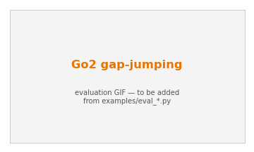

# Go2 gap-jumping

A Unitree Go2 quadruped approaches a pit and must either **brake to a safe stop**
or **commit to a leap** across it — never stall airborne over the gap. It is the
campaign's flagship reach-avoid task: the jump is a *committed* maneuver (once
airborne over the pit, braking is fatal), which is exactly where avoid-only
filtering livelocks and reach-avoid is needed.

{ width="520" }

## The pipeline

The jump does not emerge from scratch — it forms through staged warm-starts
(`TaskSpec.warmstart_from`), each stage seeding a rare-win skill for the next:

| task | objective | learner | warm-starts from |
|---|---|---|---|
| `go2_gap_landing` | soft-land from mid-air over the gap | `SafetyPPO` (avoid) | — |
| `go2_gap_crossing` | reverse curriculum: landing → launch | `SafetyPPO` (avoid) | landing |
| `go2_gap_chain` | arrival momentum → brake-or-jump → safe rest | `ReachAvoidPPO` | crossing |
| `go2_gap_chain_isaacs` | chain + worst-case base-force adversary | `GameplayPPO` | chain |

## Margins

- **`g`** (safety) = `g_terrain_relative`: `min` of terrain-relative base height,
  tilt, and non-foot contact — negative when the robot falls / plants a non-foot
  body. Rides on the reward channel; the env terminates on `g < 0`.
- **`l`** (target) = a rest / gap-completion margin: `≥ 0` once the robot is past
  the gap and at a stable stop on the far platform. Zero for the avoid-only
  landing/crossing stages.

See [`robot_safety_sandbox/margins.py`](../reference.md#margins) and
`envs/go2_gap/`.

## Run it

```bash
# reach-avoid chain (single-player)
python examples/train.py --task go2_gap_chain
# + worst-case force adversary (two-player reach-avoid -> GameplayPPO)
python examples/train.py --task go2_gap_chain --adversary
```

```python
from robot_safety_sandbox import make_tensor, algo_name
env = make_tensor("go2_gap_chain", num_envs=2048)     # ~50k steps/s on 12 GB
# algo_name("go2_gap_chain") -> "ReachAvoidPPO";  (..., adversary=True) -> "GameplayPPO"
```

The gap family forms its jump only at real scale (~2B env-steps for the chain);
watch the `env/Curriculum/*` logger keys — a stalled curriculum looks exactly
like converged training in the reward curve.
