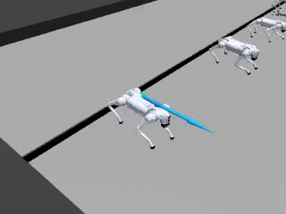
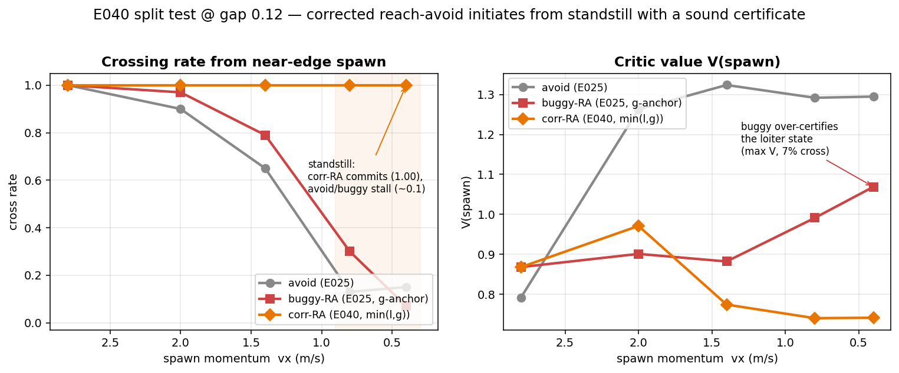
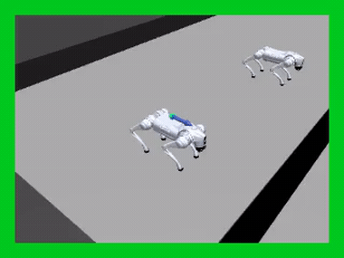

# Go2 gap-jumping

A Unitree Go2 quadruped approaches a pit and must either **brake to a safe stop**
or **commit to a leap** across it — never stall airborne over the gap. It is the
campaign's flagship reach-avoid task: the jump is a *committed* maneuver (once
airborne over the pit, braking is fatal), which is exactly where avoid-only
filtering livelocks and reach-avoid is needed.

{ width="520" }

## The pipeline

The jump does not emerge from scratch — it forms through staged warm-starts
(`TaskSpec.warmstart_from`), each stage seeding a rare-win skill for the next:

| task | objective | learner | warm-starts from |
|---|---|---|---|
| `go2_gap_landing` | soft-land from mid-air over the gap | `SafetyPPO` (avoid) | — |
| `go2_gap_crossing` | reverse curriculum: landing → launch | `SafetyPPO` (avoid) | landing |
| `go2_gap_chain` | arrival momentum → brake-or-jump → safe rest | `ReachAvoidPPO` | crossing |
| `go2_gap_chain_isaacs` | chain + worst-case base-force adversary | `GameplayPPO` | chain |

## The split test — reach-avoid vs avoid, one variable

The controlled experiment for the claim. Two twins share **everything** — the same
reverse curriculum over *harvested real jump states*, the same warm-start, the same
optimizer — and differ in exactly one variable: whether a reach term `l` is present.

| task | learner | reach term |
|---|---|---|
| `go2_gap_brake_or_jump_avoid` (`_w20`, `_w30`) | `SafetyPPO` | none (`compose(g)`) |
| `go2_gap_brake_or_jump_ra` (`_w20`, `_w30`) | `ReachAvoidPPO` | `l_stable_far` (`compose(g, l)`) |

`brake_or_jump_harvest.py` collects real jump states into a bank; `brake_or_jump.py` replays them
on a reverse curriculum whose final level is a decision mixture (far+slow "runway",
near+fast "committed", near+slow "stoppable"). Widths `_w20`/`_w30` widen the gap
(0.12 → 0.20 → 0.30 m) up a warm-started chain.

{ width="640" }

Under the corrected reach-avoid anchor (`min(l, g)`; see
[release notes](https://github.com/SafeRoboticsLab/safety-stable-baselines)), the
reach-avoid twin **initiates the crossing from a standstill** — 100 % crossing at
every spawn momentum, at all three gap widths, with ~0–1 % falls — while the
avoid twin (and a reach-avoid twin trained under the old `g`-anchor) stalls at low
momentum and its critic over-certifies the non-crossing state. The value is *lower*
but sound: every point of it is backed by a realized safe crossing.

## Live safety filter — defer, then jump

Wrap the blind flat walker in a value-shield filter built from each twin's `V(s)`
+ fallback policy. The robot starts back from the edge and walks forward:

{ width="520" }

The **reach-avoid** filter defers to the walker over the whole approach (the state is
reach-avoid-feasible), engages **only at the edge** to execute the jump, and releases
after landing — the robot crosses and walks on. The **avoid-only** filter brakes at the
braking boundary and the robot livelocks short of the gap. (Border tint = fraction of
the herd under filter control: green walker / red safety fallback.)

## Margins

- **`g`** (safety) = `g_terrain_relative`: `min` of terrain-relative base height,
  tilt, and non-foot contact — negative when the robot falls / plants a non-foot
  body. Rides on the reward channel; the env terminates on `g < 0`.
- **`l`** (target) = a rest / gap-completion margin: `≥ 0` once the robot is past
  the gap and at a stable stop on the far platform. The avoid twin declares no `l`.

See [`robot_safety_sandbox/margins.py`](../reference.md#margins) and
`envs/go2_gap/`.

## Run it

```bash
# reach-avoid chain (single-player)
python examples/train.py --family on_policy --task go2_gap_chain
# + worst-case force adversary (two-player reach-avoid -> GameplayPPO)
python examples/train.py --family on_policy --task go2_gap_chain --adversary

# split test: reach-avoid vs avoid twins, per gap width
python examples/train.py --family on_policy --task go2_gap_brake_or_jump_ra   --load runs/go2_gap_crossing/final_model.zip
python examples/train.py --family on_policy --task go2_gap_brake_or_jump_avoid --load runs/go2_gap_crossing/final_model.zip

# evaluate: value ordering + cross/fall rates, and the live safety filter
python examples/eval_brake_or_jump_value.py --task go2_gap_brake_or_jump_ra_w30 \
    --ra-model runs/<ra_run>/final_model.zip --avoid-model runs/<avoid_run>
python examples/eval_brake_or_jump_filter.py --safety runs/<ra_run>/final_model.zip \
    --spawn-x-rel -0.8 --cmd-vx 0.85 --out ra.mp4
```

```python
from robot_safety_sandbox import make_tensor, algo_name
env = make_tensor("go2_gap_chain", num_envs=2048)     # ~50k steps/s on 12 GB
# algo_name("go2_gap_chain") -> "ReachAvoidPPO";  (..., adversary=True) -> "GameplayPPO"
```

The gap family forms its jump only at real scale (~2B env-steps for the chain);
watch the `env/Curriculum/*` logger keys — a stalled curriculum looks exactly
like converged training in the reward curve.
