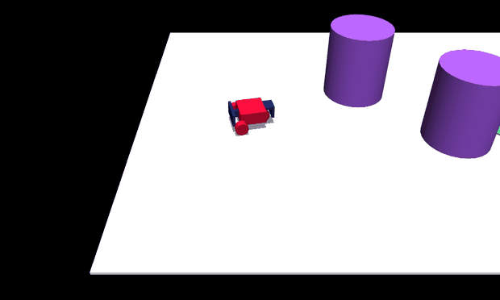

# Environments

The mjlab / GPU robot benchmark environments that ship with `robot_safety_sandbox`
— reach-avoid and avoid-only, single-agent and adversarial (ISAACS), on GPU
end-to-end. Each is a `TaskSpec` in the [registry](../API.md#3-registry-api);
`make_tensor("<id>")` builds it for a `safety_sb3` learner.

For the small **CPU reference environments** (bicycle, pendulum, …) that ship
with the algorithm layer, see the
[safety-stable-baselines environment showreel](https://github.com/SafeRoboticsLab/safety-stable-baselines).

-   ### [Car-goal (tutorial)](../tutorial-car-goal.md)

    { width="320" }

    The new-user walkthrough: a diff-drive car reaches a goal while avoiding
    obstacles. One small robot, built from scratch, seven steps.

    `ReachAvoidPPO`

-   ### [Go2 gap-jumping](go2-gap.md)

    { width="320" }

    A quadruped brakes or commits to a leap over a pit. The flagship
    reach-avoid pipeline: `landing → crossing → chain → +ISAACS`.

    `SafetyPPO` · `ReachAvoidPPO` · `GameplayPPO`

-   ### [Go2 crawl](go2-crawl.md)

    { width="320" }

    Duck under a low bar or stop — temporal commitment with a closing gate.
    Includes the avoid-vs-reach-avoid twins.

    `SafetyPPO` · `ReachAvoidPPO` · `GameplayPPO`

-   ### [Digit stabilize](digit.md)

    { width="320" }

    A humanoid stays upright against a worst-case torso force. Two-player
    **avoid** (ISAACS proper).

    `SafetyPPO` · `IsaacsPPO`

Each page follows the same shape: what the task is, its `g`/`l` margin design,
the learner (and the `--adversary` two-player variant), a run-it snippet, and the
expected result. GIFs are captured from evaluation rollouts; see each page for the
`examples/eval_*.py` command.
