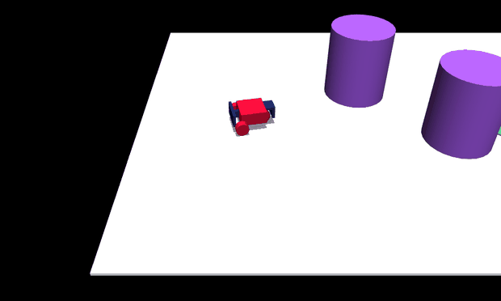
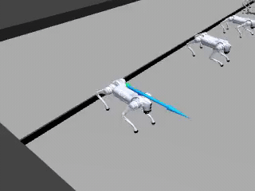
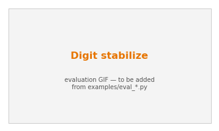

# Environments catalog

The mjlab / GPU robot benchmark environments that ship with
`robot_safety_sandbox` — reach-avoid, avoid-only, and dense-reward, single-agent
and adversarial, end to end on GPU. Each is a `TaskSpec` in the
[registry](../reference/registry.md); `make_tensor("<id>")` builds it for a
`safety_sb3` learner.

Learner names follow the [MAP](../concepts/map.md) — the names shown are the
on-policy (PPO) family; swap `PPO`→`SAC` for `--family off_policy`.

!!! info "Maturity labels"
    `list_tasks()` deliberately exposes internal and experimental variants
    alongside the primary public tasks. Use these labels to tell them apart:
    **Tutorial** · **Stable** (reproduced, recommended) · **Research** (a shipped
    result; needs staged training / real scale) · **Experimental** (shelved or in
    progress; may not reproduce) · **Requires custom mjlab fork** (imports on
    stock mjlab, needs a fork to simulate).

## Featured environments

-   ### [Car goal](../tutorial-car-goal.md) · Tutorial

    { width="300" }

    A differential-drive car reaches a goal while avoiding obstacles. The
    new-user walkthrough, built from scratch. `ReachAvoidPPO1P`

-   ### [Go2 stabilize / locomotion](go2-stabilize.md) · Stable

    A quadruped stays upright (and tracks a command) against a worst-case force.
    The simplest and most-reproduced safety benchmark. `ReachAvoid*` / `Safety*`

-   ### [Go2 gap-jumping](go2-gap.md) · Research

    { width="300" }

    A quadruped brakes or commits to a leap over a pit — the flagship reach-avoid
    pipeline. `SafetyPPO1P` · `ReachAvoidPPO1P` · `ReachAvoidPPO2P`

-   ### [Digit stabilize](digit.md) · Requires custom mjlab fork

    { width="300" }

    A humanoid stays upright against a worst-case torso force — two-player avoid.
    `SafetyPPO1P` · `SafetyPPO2P`

Also documented: [Go2 crawl](go2-crawl.md) (Experimental — the low-bar / closing-gate
crawl thread).

## Primary tasks

| Task ID | Robot | Mode | Objective | Adversary | Maturity |
|---|---|---|---|---|---|
| `car_goal` | diff-drive car | reach-avoid | drive to a goal disk, avoid obstacle cylinders | — | **Tutorial** |
| `go2_stabilize` | Go2 | reach-avoid | stand / stay upright vs adversarial base force | ✔ | **Stable** |
| `go2_locomote` | Go2 | reach-avoid | track a velocity command vs adversarial force | ✔ | Research |
| `go2_walker_flat` | Go2 | cumulative | dense-reward flat walker — the task policy filters wrap | — | **Stable** |
| `go2_walker_filtered` | Go2 | cumulative | task policy trained *inside* a filter (PORL showcase) | ✔ | Research |

## Go2 gap-jumping family (Research)

The jump forms through staged warm-starts; the split-test twins isolate the
reach-avoid-vs-avoid contrast. See [Go2 gap-jumping](go2-gap.md).

| Task ID | Mode | Objective | Learner (1P) |
|---|---|---|---|
| `go2_gap_landing` | safety | soft-land from mid-air over the gap | `SafetyPPO1P` |
| `go2_gap_crossing` | safety | reverse curriculum: landing → launch | `SafetyPPO1P` |
| `go2_gap_chain` | reach-avoid | arrival momentum → brake-or-jump → safe rest | `ReachAvoidPPO1P` |
| `go2_gap_chain_isaacs` | reach-avoid | chain + worst-case base-force adversary | `ReachAvoidPPO1P` (`--adversary` → 2P) |
| `go2_gap_brake_or_jump_ra` (`_w20`, `_w30`) | reach-avoid | split-test reach-avoid twin | `ReachAvoidPPO1P` |
| `go2_gap_brake_or_jump_avoid` (`_w20`, `_w30`) | safety | split-test avoid twin | `SafetyPPO1P` |

## Digit (Requires custom mjlab fork to simulate)

Assets and cfgs are vendored and import cleanly on stock mjlab; **stepping the
sim** needs the lab's mjlab entity-patch fork. See [Digit stabilize](digit.md).

| Task ID | Mode | Objective |
|---|---|---|
| `digit_stabilize` | reach-avoid | stand / track vs adversarial torso force |
| `digit_stabilize_avoid` · `digit_stabilize_stay` | safety | stay upright forever |
| `digit_box_stabilize_avoid` · `digit_box_stabilize_stay` | safety | as above + keep a box balanced |

All Digit tasks declare `supports_adversary` (two-player avoid / reach-avoid).

## Experimental tasks (folded threads)

The crawl / low-bar / tunnel line is shelved (a model-free reach-avoid *executor*
hit a ~0.3 success ceiling on sustained crawling); the environments remain
registered for reference and may not reproduce a clean result. These appear in
`list_tasks()` but are **not** recommended entry points.

| Family | Task IDs | Mode(s) |
|---|---|---|
| Crawl | `go2_crawl`, `go2_crawl_duck`, `go2_crawl_gate_ra` / `_gate_avoid`, `go2_crawl_twin_ra` / `_twin_avoid`, `go2_crawl_isaacs`, `go2_crawl_locomote`, `go2_crawl_walk` | reach-avoid / safety / cumulative |
| Low bar | `go2_low_bar_ra` / `_avoid` (+ `_h70` / `_h80` / `_h90`), `go2_low_bar_gate_ra` / `_gate_avoid`, `go2_low_bar_bridge` | reach-avoid / safety / cumulative |
| Tunnel | `go2_tunnel_ra` / `go2_tunnel_avoid` | reach-avoid / safety |
| Rendering-only | `*_video` variants (e.g. `go2_crawl_duck_video`, `go2_crawl_walk_video`) | — |

## The algorithm layer's CPU reference environments

For the small **CPU reference environments** (bicycle, pendulum, …) that ship with
the algorithm layer, see the
[safety-stable-baselines](https://github.com/SafeRoboticsLab/safety-stable-baselines)
environment showreel.

## Page template

Each environment page follows a standard shape: a compact operational summary
(status / requirements, task IDs, success/failure, spaces, margins, config,
budget, train / evaluate / visualize, expected result, limitations, source files)
followed by the research narrative. GIFs are captured from evaluation rollouts;
see each page for the `examples/eval.py` command.
