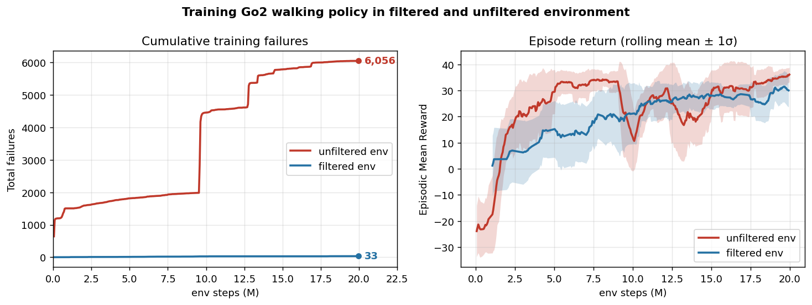

# Training a policy inside a safety filter

Most of this repo trains a policy and *then* wraps it in a safety filter at
evaluation time. This page is about the other direction: putting the filter
**around the environment during training**, so the task policy learns while a
fallback controller guarantees it (nearly) never fails.

This is the **PORL setting** — *Provably Optimal Reinforcement Learning under
Safety Filtering* (Oh, Nguyen, Hu, Fisac; IASEAI 2026, arXiv:2510.18082). The
claim under test: a task policy trained inside a filter reaches the same
asymptotic return as one trained bare, at the same rate or slightly faster,
while making near-zero catastrophic transitions *during* training — and is very
safe when later deployed under the same filter.

## The two arms

The experiment is an A/B with a shared code path:

- **Control (unfiltered):** ordinary training on the env's own reward.
- **Treatment (filtered):** every action the policy proposes is certified by a
  safety filter built from a fallback twin; when the proposal is uncertified the
  filter substitutes the fallback's action, and **the executed action — not the
  proposal — is what enters the replay buffer.** Storing the proposal against the
  resulting transition would fit the critic to a transition that never happened.
  Off-policy learning makes the substitution exactly correct with no importance
  correction, which is why filtered training is run with **SAC**.

Both arms count failures the same way through one shared accounting path (see
[Failure counting is always on](#failure-counting-is-always-on)), so the
headline plot measures the policies, not the instrumentation.

## Result: the Go2 velocity walker

We ran both arms on `go2_walker_filtered` (a Go2 velocity walker; `filter: critic`
built from a `go2_stabilize` `ReachAvoidSAC2P` fallback), seed 0, capping the
comparison at 20M env-steps — the point where both arms plateau.



- **Training-time safety — the headline.** By 20M steps the unfiltered arm had
  accumulated **6,056** catastrophic training failures (`safety/failures_total`);
  the filtered arm had **33** — a **~180× reduction**. The filtered curve is flat
  near zero from the first step: the fallback catches unsafe proposals before they
  become terminations, so the policy essentially never falls during training.
- **No task-performance tax.** The two arms reach **comparable return**
  (`ep_rew_mean` ≈ 35 filtered vs ≈ 37 unfiltered at the cap; the rolling ±1σ
  bands overlap throughout and trade the lead). Training inside the filter did
  **not** slow learning or cap the achievable return — it removed the failures for
  free.
- **The policy weans off the fallback.** `safety/engaged_frac` — the fraction of
  steps the fallback actually drove — starts around **0.21** and falls to **~0.10**
  by 20M as the task policy learns to stay safe on its own.

This is the PORL claim made concrete: a policy trained inside a safety filter
reaches the same performance as one trained bare while making orders of magnitude
fewer failures along the way.

!!! note "Scope of this result"
    Single seed (seed 0), compared at a 20M-step cap; the return band is a rolling
    mean ± 1σ over the (noisy) single run. It demonstrates the failures-vs-return
    trade cleanly but is not a multi-seed benchmark.

## The config path (recommended)

Add a `safety_filter:` block to a training config and run it through
`examples/train.py`. Presence of `safety_policy` selects the treatment arm; its
absence is the control arm.

```yaml
# configs/go2_walker_filtered.yaml (excerpt)
family: off_policy                 # SAC — required for the executed-action readback
task: go2_walker_filtered          # a cumulative task with dense_margins

safety_filter:
  safety_policy: runs/go2_stabilize_reachavoidsac2p/final_model.zip  # the fallback twin
  filter: critic                   # value | critic | qcbf
  eps: 0.1                         # switching threshold
  smoothing: false                 # canonical switch (not HeuristicSmoothing)
```

```bash
# treatment arm
python examples/train.py --config configs/go2_walker_filtered.yaml

# control arm: same recipe, no filter (clear safety_policy on the CLI)
python examples/train.py --config configs/go2_walker_filtered.yaml \
    --safety-filter safety_policy= --run-suffix control
```

`--safety-filter KEY=VAL` (repeatable) overrides one key of the block at a time,
mirroring `--env-override`. Only the SAC (`off_policy`) trainer reads the block.

| key | meaning | default |
|-----|---------|---------|
| `safety_policy` | fallback twin checkpoint; **present → filtered, absent → control** | — |
| `filter` | composition: `value` \| `critic` \| `qcbf` | `critic` |
| `eps` | switching threshold (hand over when the monitored margin ≤ eps) | `0.0` |
| `smoothing` | use `HeuristicSmoothingIntervention` instead of the canonical switch | `false` |

The rollout/gameplay monitors are deliberately not offered here: a shadow sim
inside the training loop is a separate design question.

## The library path

Under the config is a small env wrapper you can use directly:

```python
from robot_safety_sandbox import make_tensor
from robot_safety_sandbox.eval.filters import SwitchCfg, build_filter
from robot_safety_sandbox.eval.policies import load_twin, safety_modules
from robot_safety_sandbox.filtered_env import FilteredTensorEnv

env = make_tensor("go2_walker_filtered", num_envs=1024, device="cuda:0")

model, norm = load_twin("runs/go2_stabilize_reachavoidsac2p/final_model.zip", "cuda:0")
mods = safety_modules(model, env.num_envs, "cuda:0"); mods["norm"] = norm
bundle = build_filter("critic", mods, env, switch=SwitchCfg(eps=0.1))

env = FilteredTensorEnv(env, bundle.filt, norm=norm)   # now train `env` with a SAC learner
```

`FilteredTensorEnv(env, filter)` publishes the executed action on
`env.executed_action`; the off-policy collector
(`safety_sb3.sac_base._collect_rollouts_tensor`) reads it back so the buffer
holds the transition that really happened. Passing `filter=None` gives a
transparent pass-through (every transition is the policy's own action) — but the
control arm normally just uses the bare env, which already counts failures.

## Failure counting is always on

Because this is a safety codebase, **every** training env reports how often it
fails during training — no flag, no wrapper. The base tensor env
(`MjlabTensorSafetyEnv`) folds each step into counters drained through
`metrics()` as `safety/*`:

| metric | meaning |
|--------|---------|
| `safety/failures_total` | cumulative real terminations (not timeouts) over the run |
| `safety/failures_per_1k` | the same, per 1000 env-steps in the window |
| `safety/failure_rate` | fraction of episodes this window ending in failure |
| `safety/episodes` | episodes ended this window |
| `safety/margin_mean`, `safety/margin_min` | the task margin `g` (only when the env computes one) |
| `safety/engaged_frac` | fraction of env-steps the fallback drove (filtered arm only) |

`safety/failures_total` is the headline plot's y-axis. The filtered arm's
`ep_len_mean` (logged by the learner) is the sanity check: it must sit at the
episode limit essentially from step one, or the filter is not doing its job.
