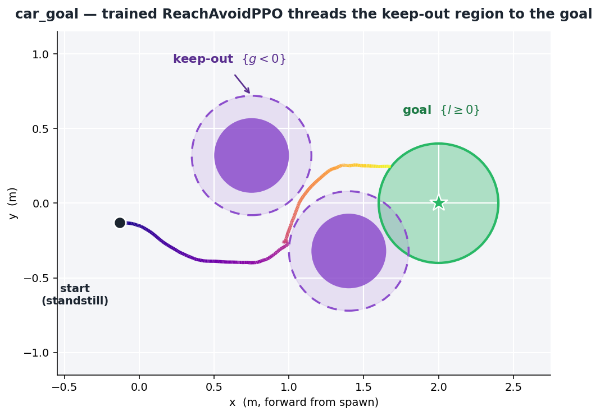

# Tutorial: your first safety environment

This is the **new-user walkthrough**. We build one complete task from scratch — a
differential-drive car that must **reach a goal while avoiding obstacles** — and
train a reach-avoid safety policy on it end to end. Every file we touch is small,
and every choice is explained from the theory up.

{ width="560" }

*The finished product: a trained `ReachAvoidPPO` policy driving the car from a
standstill, weaving between the two purple obstacles, into the green goal disk.*

By the end you will have touched the whole stack once, in the order you would
build your own robot:

**asset → arena → environment → margins → task → algorithm → config → run.**

!!! abstract "The three layers you are wiring together"
    | layer | what it owns | this repo |
    |---|---|---|
    | **mjlab** | the physics: MJCF specs, actuators, terrains, the GPU sim | your simulator |
    | **robot_safety_sandbox** (the *sandbox*) | the safety *contract*: tasks, margins `(g, l)`, the registry, the two bridges | **this repo** |
    | **safety_sb3** | the *learners*: SafetyPPO / ReachAvoidPPO / Isaacs / Gameplay, on GPU | the algorithm layer |

    The sandbox is the thin, honest middle: it turns a plain mjlab environment
    into a *specification* a safety learner can optimize, and nothing more. Learn
    this one example and you can bring any mjlab robot into the same pipeline.

The finished files live under `robot_safety_sandbox/envs/assets_car/`,
`envs/terrains/car_arena.py`, `envs/car_goal/env_cfg.py`, and
`tasks/car_goal.py`. Read this page top-to-bottom, then open those four files —
they will read like prose.

---

## 0. The one idea: a margin *is* the specification

Classical RL hands the agent a hand-tuned **reward** and hopes the maximizer does
something safe. Safety RL inverts this. You hand the agent two **margins**, each a
signed distance in the world, and the learner solves a *reach-avoid* problem
defined entirely by their sign:

| symbol | meaning | sign convention |
|---|---|---|
| `g(s)` | **safety margin** — how far from failure | `g ≥ 0` ⟺ **safe** (outside the failure set) |
| `l(s)` | **target margin** — how far into the goal | `l ≥ 0` ⟺ **reached** (inside the target set) |

The failure set is *defined* as `{s : g(s) < 0}`; the target set as `{s : l(s) ≥ 0}`.
There is no separate reward to shape or overfit — **the geometry is the task**.

The learner approximates the reach-avoid value function (a Hamilton–Jacobi
reachability value, learned by RL) with the safety Bellman backup

$$
V(s) \;=\; (1-\gamma)\,\min\!\big(l,\,g\big)\;+\;\gamma\,\min\!\Big(g,\;\max\big(l,\,V(s')\big)\Big).
$$

Read it in words: **you can only ever be as safe as your worst future `g`** (the
outer `min(g, ·)` — one collision anywhere on the trajectory condemns the whole
path), and along a safe path you want to eventually **reach** (`max(l, V')` lets a
future arrival raise today's value). `V(s) ≥ 0` certifies a control-invariant
*reach-avoid* state: from here the policy can reach the goal without ever entering
the failure set. That is the object we are training.

Everything below is just *supplying `g` and `l` honestly* for one small robot.

---

## 1. The asset — a robot mjlab can drive

**Files:** `envs/assets_car/xmls/car.xml`, `envs/assets_car/car_constants.py`

A task needs a body. We copied a minimal differential-drive car MJCF — a chassis
on a free joint, two independently-driven wheels (`left`, `right`), and a passive
caster — and wrapped it the way every robot in this repo is wrapped: a `get_spec`
that loads the MJCF, and an `EntityCfg` that tells mjlab how to actuate it.

```python
# car_constants.py  (abridged)
def get_spec() -> mujoco.MjSpec:
    return mujoco.MjSpec.from_file(str(CAR_XML))

WHEEL_ACTUATOR = BuiltinVelocityActuatorCfg(
    target_names_expr=("left", "right"),   # a velocity servo per wheel
    damping=5.0, effort_limit=2.0, armature=0.001)

INIT_STATE = EntityCfg.InitialStateCfg(
    pos=(0.0, 0.0, 0.1),
    rot=(0.7071, 0.0, 0.0, 0.7071),        # +90° yaw about z  (w, x, y, z)
    joint_pos={"left": 0.0, "right": 0.0}, joint_vel={".*": 0.0})
```

!!! question "Why initialize the robot at all?"
    Two reasons, both about making the task *learnable*.

    - **Orientation.** The car's mechanical "forward" is its body `-y` axis, but
      our whole arena is laid out along world `+x`. The `+90°` yaw in `rot` rotates
      the default pose so *forward means `+x`* — the direction the goal lives. Get
      this wrong and the policy spends its first million steps discovering it must
      drive sideways. **A good default pose aligns the robot's natural DOFs with
      the task's geometry.**
    - **A standstill start.** `joint_vel = 0` means every episode begins *at rest*.
      This is deliberate: it forces the policy to **initiate** motion. It is the
      single cleanest way to tell a real reach-avoid policy apart from a lazy
      avoid one (see §6) — the lazy one just sits still, already "safe", and never
      reaches.

We drive the wheels with **velocity servos**, not torques: the policy commands a
target wheel speed and the servo tracks it. For a light car this makes the action
space forgiving and the diff-drive kinematics (turn by wheel-speed difference)
transparent — exactly what you want in a teaching example.

---

## 2. The arena — obstacles as *keep-out regions*, not walls

**File:** `envs/terrains/car_arena.py`

The world is a flat plate, two obstacle cylinders forming a light slalom, and a
goal disk. In mjlab you add these as geoms inside a `SubTerrainCfg.function`:

```python
OBSTACLES = ((0.75,  0.32, 0.25),     # (dx, dy, radius), relative to the spawn
             (1.40, -0.32, 0.25))
START_TO_GOAL = 2.0                    # goal is 2 m ahead of the spawn
GOAL_RADIUS   = 0.40

for dx, dy, r in OBSTACLES:
    cyl = body.add_geom(type=mjGEOM_CYLINDER, pos=(ox+dx, oy+dy, H), size=(r, H, r))
    cyl.rgba = PURPLE
    cyl.contype = 0                    # <-- VISUAL ONLY: no physical collision
    cyl.conaffinity = 0
```

That `contype = conaffinity = 0` is the most important line on the page, and the
place newcomers get safety RL wrong.

!!! danger "Why the obstacles are *not* solid walls"
    The failure set is defined by the **margin**, not by physics. If the obstacle
    cylinders were collidable, MuJoCo would stop the car at their surface — the car
    could never actually *enter* the region, so `g` would never go negative, and
    the collision termination could never fire. The learner would never see a
    single failure and would have nothing to learn to avoid. The world and the
    specification would silently disagree.

    Making the obstacles **visual-only keep-out regions** lets the car drive into
    `{g < 0}`; that trips the termination, the episode ends, and the Bellman backup
    anchors the value to failure right there. **The obstacle is a region in the
    margin, not an object in the world.** (The goal disk is visual-only for the
    same reason: reaching it is an analytic `l ≥ 0` event; it must not physically
    shove the car.)

The layout is fixed and identical across arenas; **per-episode variety comes from
a randomized car spawn** (§3), so the visual geoms and the analytic `g` can never
drift apart — the obstacle you *see* is exactly the obstacle in the *math*.

The palette (light floor, purple hazards, green target) is chosen so the showcase
GIF reads at a glance. Rendering uses `color_scheme="height"` so each geom keeps
its own color instead of a uniform grey.

---

## 3. The environment — scene, senses, actions, resets

**File:** `envs/car_goal/env_cfg.py`

Now assemble a `ManagerBasedRlEnvCfg`: the mjlab object that says *what the robot
senses, how it acts, and when an episode ends*. This is plain mjlab — no safety
concepts leak in yet.

### Observations — why *car-frame*

```python
obs_terms = {
    "root_vel":  ObservationTermCfg(func=obs_root_vel),      # (vx, vy, wz) in the body frame
    "goal":      ObservationTermCfg(func=obs_goal_car),      # goal offset, rotated into the car frame
    "obstacles": ObservationTermCfg(func=obs_obstacles_car), # each obstacle (dx, dy, r), car frame
}
```

!!! question "Why rotate everything into the car's frame?"
    **Invariance = sample efficiency.** The correct action ("the goal is front-left,
    an obstacle is dead ahead, so arc right") depends only on where things are
    *relative to the car* — not on the car's absolute `(x, y, yaw)` in the world.
    Feeding egocentric observations makes the policy automatically generalize over
    every spawn position and heading: it learns *one* reactive rule instead of
    re-learning it in each corner of the arena. This is why we bother with the
    `quat_apply_inverse` that maps world offsets into the body frame, and why the
    randomized spawn heading (below) is free variety rather than a new task.

The car senses its own planar velocity and yaw rate (so it can tell if it is
already moving), plus the goal and both obstacles as egocentric `(Δx, Δy)` vectors.
That is the complete, minimal state needed to solve the task — nothing more.

### Actions — the two wheels

```python
actions = {"wheels": JointVelocityActionCfg(
    entity_name="robot", actuator_names=(".*",), scale=20.0, use_default_offset=True)}
```

Two numbers in `[-1, 1]`, scaled to a wheel-speed target of ±20 rad/s (≈ 1 m/s top
speed). Drive both forward → go straight; drive them apart → turn. That is the
entire control interface, and it is why `ctrl_dim = 2` in the task spec (§5).

### Events — the randomized standstill spawn

```python
"reset_base": EventTermCfg(func=reset_root_state_uniform, mode="reset", params={
    "pose_range": {"x": (-0.2, 0.2), "y": (-0.3, 0.3), "yaw": (-0.4, 0.4)},
    "velocity_range": {}})     # empty -> zero initial velocity -> starts from REST
```

Small position + heading jitter each episode is the anti-memorization pressure
(combined with the egocentric obs, it teaches a *reactive* policy). The empty
velocity range keeps the standstill start from §1 — the property that makes the
reach-avoid-vs-avoid contrast meaningful.

### Terminations — when the episode ends

```python
terminations = {
    "time_out":  TerminationTermCfg(func=time_out, time_out=True),
    "collision": TerminationTermCfg(func=car_collision),   # fires on g < 0
}
```

`car_collision` returns `g < 0`: **entering an obstacle is an absorbing failure.**
Making it terminal is what lets the safety backup anchor the value to the failure
value at the collision state (mirroring the reference `terminated = g < 0`). The
*reach* termination is added automatically by the sandbox — see §5.

!!! tip "The `play` argument and the viewer"
    `car_goal_env_cfg(play=False)` returns a fresh config every call, so training
    and rendering never share mutable state. The `ViewerConfig` at the bottom of
    the file is what produced the GIF above (a chase camera; `max_extra_envs=0` and
    a single terrain patch for a clean single-arena shot).

---

## 4. The margins — supplying `g` and `l`

**File:** `envs/car_goal/env_cfg.py` (the `car_margins` function)

This is the heart of the task, and the whole reason the sandbox exists. Two signed
distances, each `≥ 0` when good:

```python
def car_margins(env):
    p = _car_local_xy(env)                                     # car position, spawn-relative
    obs = _obstacles(p.device)                                 # (M, 3): dx, dy, r
    clearance = ‖p − obs[:, :2]‖ − obs[:, 2] − CAR_RADIUS      # signed gap to each obstacle
    g = (clearance.amin(dim=1) / G_SCALE).clamp(-3, 3)         # nearest obstacle -> safety

    dist = ‖p − goal‖
    l = ((GOAL_RADIUS − dist) / L_SCALE).clamp(-3, 3)          # inside the disk -> reached
    return g, l
```

- **`g`** = distance from the car's footprint to the *nearest* obstacle surface.
  Positive in free space, exactly `0` at the keep-out boundary, negative once the
  car overlaps an obstacle. The `amin` over obstacles encodes "safe means clear of
  **all** of them" (`min` = logical AND).
- **`l`** = `goal_radius − distance_to_goal`. Positive inside the disk, negative
  outside. It stays *graded* all the way back to the spawn (via `L_SCALE`), so the
  reach gradient never flattens to zero far from the goal — the policy always feels
  a pull toward the target.

!!! question "Why normalize and clamp every margin?"
    The margins *are* the Bellman targets. If `g` ranged over meters and `l` over
    centimeters, the critic would see wildly different scales and the `min`/`max`
    backup would be dominated by whichever term is numerically larger — not the one
    that is physically closer to its boundary. Dividing by an `O(1)` scale and
    clamping to `±3` keeps both terms comparable and the value bounded, which is
    what keeps the safety Bellman iteration stable. **The sign carries the
    specification; the scale must not distort it.**

Here is what these two margins *look like* — the trained policy's actual path
plotted over the geometry `g` and `l` encode:

{ width="640" }

The **dashed purple circles** are the `g = 0` boundary (obstacle radius + car
radius): the set the car's center must stay outside. The **green disk** is the
`l ≥ 0` target. The **path** (dark → bright with time) is the trained rollout —
from a standstill it arcs below the first keep-out region, threads the gap, and
enters the goal. Nowhere does it cross a dashed circle: it stays in `{g ≥ 0}` the
whole way and terminates on `{l ≥ 0}`. *That is a realized reach-avoid trajectory.*

---

## 5. The task — one registration ties it together

**File:** `tasks/car_goal.py`

A **task** is exactly three things: an mjlab config builder, a margin function, and
a `TaskSpec` that records how to train it. Register once, and both GPU/PPO and
SB3/SAC bridges can build it.

```python
register(TaskSpec(
    task_id="car_goal",
    cfg_builder=car_goal_env_cfg,       # §3  — the plain mjlab environment
    margin_fn=car_margins,              # §4  — supplies (g, l)
    ctrl_dim=2,                         # §3  — two wheel commands
    default_algo="ReachAvoidPPO",       # this is a REACH-avoid task
    supports_adversary=False,           # single-player (no disturbance agent)
    end_criterion="reach-avoid",        # end on reach OR collision (see below)
    description="Drive to the goal disk while avoiding obstacle cylinders."))
```

!!! abstract "`default_algo` picks the *problem*; `--adversary` picks the *players*"
    The sandbox keeps a 2×2 honest. The task's margins fix the **column** (does it
    have a target set?), and the run's `--adversary` flag fixes the **row** (is
    there a disturbance player?):

    | task problem | 1-player | 2-player (`--adversary`) |
    |---|---|---|
    | **avoid** (`default_algo=SafetyPPO`) | `SafetyPPO` | `IsaacsPPO` |
    | **reach-avoid** (`default_algo=ReachAvoidPPO`) | `ReachAvoidPPO` | `GameplayPPO` |

    `car_goal` declares a target (`l`), so it lives in the reach-avoid row. We run
    it single-player, so the learner resolves to `ReachAvoidPPO`. (Declaring `l` on
    a task and then training it with an *avoid* learner is refused by the registry —
    a reach-avoid problem needs a reach-avoid learner.)

`end_criterion="reach-avoid"` tells the env to **end the episode on arrival**
(`g ≥ 0 ∧ l ≥ 0`) as well as on collision. For a "drive there and stop" task this
is the natural choice — reaching the goal *is* success. (The alternative,
`"failure"`, keeps going after arrival so the value can climb *deeper* into the
target; see the [API guide](API.md#4-end_criterion-when-the-episode-ends).)

Finally, wire the registration into the package so it loads on import:

```python
# robot_safety_sandbox/__init__.py
from .tasks import car_goal as _car_goal; _car_goal.register_all()
```

That is the whole task. `make_tensor("car_goal")` now works.

---

## 6. The algorithm — why reach-avoid, not avoid

**Learner:** `safety_sb3.ReachAvoidPPO`

The task resolves to `ReachAvoidPPO`, and it *has* to. Here is the discriminating
thought experiment this whole environment is built around:

!!! example "Avoid vs reach-avoid, on the same car"
    - An **avoid** policy only cares about `g`. At the spawn, the car is already in
      free space, `g > 0` — it is *already safe*. So the optimal avoid policy is to
      **sit still forever**. It never reaches the goal, and it is perfectly happy.
    - A **reach-avoid** policy optimizes the coupled value: it must keep `g ≥ 0`
      *and* drive `l` up to the goal. From a standstill it must **initiate** the
      maneuver, weave through the keep-out regions, and arrive.

    That is why the standstill start (§1) and the target margin (§4) matter: they
    turn "avoid" and "reach-avoid" into visibly different behaviors on identical
    hardware. `reach_rate(reach-avoid) ≫ reach_rate(avoid ≈ 0)`.

The training recipe (in the config below) is the hard-won default for this repo's
PPO family: `normalize_obs=True` (normalize observations only — never the margins,
which carry the specification), a small entropy bonus, `log_std_init = ln(0.3)`,
adaptive learning rate, and short rollouts. You inherit all of it from
`examples/train.py`; you do not re-derive it.

!!! note "Gamma annealing is on by default"
    Reach-avoid values are notoriously hard to bootstrap at `γ = 1`. The learner
    starts at `γ = 0.99` and anneals toward `1` on a schedule, so the value first
    learns a well-shaped near-horizon estimate and then stretches it to the true
    reach-avoid horizon. You do not configure this — it is the default. (See the
    [safety_sb3 hyperparameters](https://saferoboticslab.github.io/safety-stable-baselines/hyperparameters/).)

---

## 7. The config and the run

**File:** `configs/car_goal.yaml`

Rather than a wall of `argparse` flags, a run is a small **recipe**. Keys are flag
names; explicit CLI flags still override the file (`argparse defaults < config <
CLI`), and every run also dumps its fully-resolved config next to the checkpoints
for exact reproduction.

```yaml
# configs/car_goal.yaml
task: car_goal
num_envs: 1024
steps: 25_000_000
seed: 0
net: "256,256"
ent_coef: 0.003
video_interval: 2_000_000
```

Launch it:

```bash
python examples/train.py --config configs/car_goal.yaml
```

That is the entire command. The trainer resolves the learner from the task
(`car_goal` × single-player → `ReachAvoidPPO`), builds `1024` GPU environments,
prints the resolved end-criterion and recipe, streams telemetry to wandb, saves
periodic videos, and writes `runs/car_goal/final_model.zip` +
`tensornormalize.pt` at the end.

```python
# or drive it yourself
from robot_safety_sandbox import make_tensor, algo_name
env = make_tensor("car_goal", num_envs=1024)      # GPU-resident tensor path
# algo_name("car_goal") -> "ReachAvoidPPO"
```

---

## 8. The result

At `25M` env-steps the trained policy reaches the goal on the large majority of
randomized spawns, weaving through the slalom from a standstill without entering a
keep-out region — the rollout in the GIF at the top, and the path in the margin
diagram in §4. A pure avoid policy on the same env sits at ≈ 0 % reach: the
contrast is the point.

You have now built, from nothing, a complete safety task and trained a certified
reach-avoid policy on it. Every robot in the [environments showreel](environments/index.md)
is the same seven steps at greater scale.

---

## Now build your own

Use `car_goal` as a template and swap one piece at a time:

1. **Asset** — drop in your robot's MJCF and write a `*_constants.py`
   (`get_spec` + `EntityCfg` + actuators + a task-aligned initial pose).
2. **Arena** — a `SubTerrainCfg.function` that adds your hazards as *visual-only
   keep-out geoms* and returns the spawn origin.
3. **Environment** — a `ManagerBasedRlEnvCfg`: egocentric observations, your action
   interface, a randomized reset, a `g < 0` termination.
4. **Margins** — a `(g, l)` function; normalize and clamp, let the sign carry the
   spec. See [`margins.py`](reference.md#margins) for reusable terms.
5. **Task** — one `TaskSpec` (`default_algo`, `end_criterion`, `ctrl_dim`), and a
   line in `__init__.py`.
6. **Algorithm** — inherit the recipe; pick avoid vs reach-avoid by whether you
   declared an `l`.
7. **Config + run** — a `configs/*.yaml` and `python examples/train.py --config …`.

Deeper references: the [API guide](API.md) (the `g`/`l` contract, `TaskSpec`,
`end_criterion`), [Extending](EXTENDING.md) (margins, sensors, terrains, contacts),
and [Porting a task](porting.md). For the learners and their knobs, see
[safety-stable-baselines](https://github.com/SafeRoboticsLab/safety-stable-baselines).
